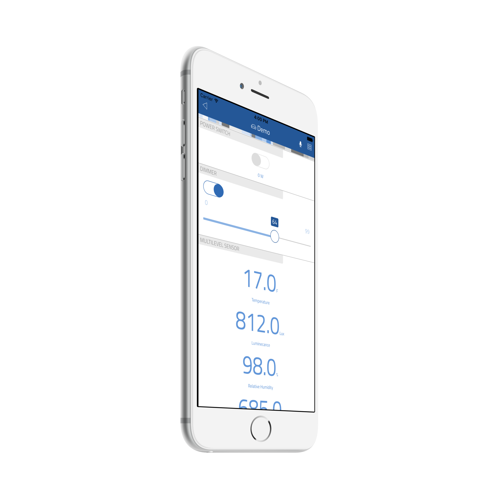

# thing-it-device-z-wave

[](https://nodei.co/npm/thing-it-device-z-wave/)
[](https://nodei.co/npm/thing-it-device-z-wave/)

[thing-it-node] Device Plugin for arbitrary Z-Wave networks and their devices.

This allows you to 

* control Z-Wave-enabled devices over the Internet,
* define complex scenes, storyboards and timer controlled execution 

by means of [thing-it-node](https://github.com/marcgille/thing-it-node) and [thing-it.com](http://www.thing-it.com).

As you can combine Z-Wave devices with other devices and can orchestrate scenarios across locations, this goes far beyond what
Z-Wave networks allow you to do with scenes and alerts.

## Installation

### Installation of Open Z-Wave

#### Linux

The [thing-it] team is testing with a Aeon Labs Z-Wave Z-Stick Series 2 USB Dongle. Most Linux distributions such as Raspbian Jessie
require no driver installation. [thing-it] expects the USB stick to be found at "/dev/ttyUSB0".

You will need to ensure the OpenZWave library and headers are installed first. You can do this one of two ways:

* Downloading the source tarball from the [OpenZWave repository](https://github.com/OpenZWave/open-zwave/releases) and then compiling it and installing on your system via **make** and **sudo make install**.
* You could also install OpenZWave via a precompiled package that's suitable for your Linux distribution and architecture. Notice: Be sure to install BOTH the binary (libopenzwave-x.y) AND the development package (libopenzwave-dev).

#### OSX

The [thing-it] team is testing with a Aeon Labs Z-Wave Z-Stick Series 2 USB Dongle. On Mac OSX this dongle
requires the installation of a driver which can be found on the support section of Aeon Lab's
[website](http://aeotec.com/support). [thing-it] is going to try to communicate with the driver via
"/dev/cu.SLAB_USBtoUART".

You will need to ensure the OpenZWave library and headers are installed first. You can do this one of two ways:

* Downloading the source tarball from the [OpenZWave repository](https://github.com/OpenZWave/open-zwave/releases) and then compiling it and installing on your system via **make** and **sudo make install**.
* You could also install OpenZWave via a precompiled package that's suitable for your Linux distribution and architecture. Notice: Be sure to install BOTH the binary (libopenzwave-x.y) AND the development package (libopenzwave-dev).

If an error related to pkg-config occurs during the build process, perform the following steps and try again.
* brew uninstall pkg-config
* brew install pkg-config
* brew unlink pkg-config && brew link pkg-config

#### Windows

Since there is no standard installation location for Open Z-Wave on Windows, it will be automatically downloaded, compiled, and installed when you install 
**openzwave-shared** via **npm** *(see below)*.

### Installation of NodeJS and [thing-it-node]

First, install [nodejs](https://nodejs.org/en/download/) on your computer (e.g. your PC or your Raspberry Pi).

Then install **[thing-it-node]** via

```
npm install -g thing-it-node
```
 
### Initialization and Start of [thing-it-node] 

The **[thing-it-device-z-wave]** Plugin is installed with **[thing-it-node]**, hence there is no need to install it separately.

The Plugin supports Autodiscovery for an existing Z-Wave network and its devices, hence you only have to create a directory in which you intend to run the configuration, e.g.
 
```
mkdir ~/hue-test
cd ~/hue-test
```

and invoke

```
tin init
```

and then start **[thing-it-node]** via

```
tin run
```

Install the **thing-it Mobile App** from the Apple Appstore or Google Play and set it up to connect to **[thing-it-node]** 
locally as described [here](https://thing-it.com/thing-it/#/documentationPanel/mobileClient/connectionModes) or just connect your browser under 
[http://localhost:3001](http://localhost:3001).
 
### Z-Wave Setup

Procure a Z-Wave USB Stick e.g. the (Aeonlab Z-Stick)[http://aeotec.com/z-wave-usb-stick] and connect it to the USB port of your node computer. Make sure that
you have the latest driver installed and identify the device the stick is connected to.

Examples are:

* **/dev/ttyUSB0** on Linux/Mac OS or
* **/dev/cu.SLAB_USBtoUART** on Linux/Mac OS or
* **\\\\.\\COM3** on Windows.

Follow the instructions for your stick to pair Z-Wave devices.

If you start **[thing-it-node]** after configuring your Z-Wave network will automatically add all Z-Wave devices to your **[thing-it-node]** Configuration and 
you will be able control these from the **[thing-it] Mobile App** immediately.

## Mobile UI

The following screenshot shows a few typical Z-Wave devices in the [thing-it] Mobile UI:
* Binary power switch with electricity consumption measurement
* Multilevel switch, often used as dimmer, with the ability to switch on and off as well as setting the level
* Multilevel sensor with temperature, luminance and humidity data

<p align="center"><a href="./documentation/images/thing-it-mobile-z-wave-switches-and-multimeter_iphone6plus_silver_side1.png"></a></p>

## Tested Devices

The following Devices have been tested regarding

* Autodiscovery,
* State Change Detection and
* Service Invocation:

| Device                 | Device Class  |Manufacturer       | Details  |
| ---------------------- |:-------------:|:-----------------:|:--------:|
| [Aeotec Z-Stick]()                                                                                                                                                                                                                   | Controller        | Aeon Labs            | |
| [Aeotec Gen5 Z-wave Plus 6-in-1 Multisensor 6 ZW100-A](http://www.amazon.com/Aeotec-Aeon-Labs-Z-wave-Multisensor/dp/B00WMEVRRW/ref=sr_1_cc_3?s=aps&ie=UTF8&qid=1455407667&sr=1-3-catcorr&keywords=z-wave+light+sensor) | Multisensor       | Aeon Labs            | |
| [DSC06106-ZWUS - Z-Wave Smart Energy Switch](http://www.amazon.com/Aeon-Labs-DSC06106-ZWUS-Z-Wave-Energy/dp/B007UZH7B8)                                                                                                   | Switch            | Aeon Labs            | |
| [CT-100 Thermostat]()                                                                                                                                                                                                               | Thermostat        | Radio Thermostat  | |
| [GoControl Z-Wave Dimmable LED Light Bulb] (http://www.amazon.com/GoControl-Z-Wave-Dimmable-Light-LB60Z-1/dp/B00PJH16UC)                                                                                                            | Light Bulb        | GoControl         | |

## Where to go from here ...

After completing the above, you may be interested in

* Configuring additional [Devices](https://www.thing-it.com/thing-it/#/documentationPanel/mobileClient/deviceConfiguration), 
[Groups](https://www.thing-it.com/thing-it/#/documentationPanel/mobileClient/groupConfiguration), 
[Services](https://www.thing-it.com/thing-it/#/documentationPanel/mobileClient/serviceConfiguration), 
[Event Processing](https://www.thing-it.com/thing-it/#/documentationPanel/mobileClient/eventConfiguration), 
[Storyboards](https://www.thing-it.com/thing-it/#/documentationPanel/mobileClient/storyboardConfiguration) and 
[Jobs](https://www.thing-it.com/thing-it/#/documentationPanel/mobileClient/jobConfiguration) via your **[thing-it] Mobile App**.
* Use [thing-it.com](https://www.thing-it.com) to safely connect your Node Box from everywhere, manage complex configurations, store and analyze historical data 
and offer your configurations to others on the **[thing-it] Mesh Market**.
* Explore other Device Plugins like [Texas Instruments Sensor Tag](https://www.npmjs.com/package/thing-it-device-ti-sensortag), [Plugwise Smart Switches](https://www.npmjs.com/package/thing-it-device-plugwise) and many more. For a full set of 
Device Plugins search for **thing-it-device** on [npm](https://www.npmjs.com/). Or [write your own Plugins](https://github.com/marcgille/thing-it-node/wiki/Plugin-Development-Concepts).
